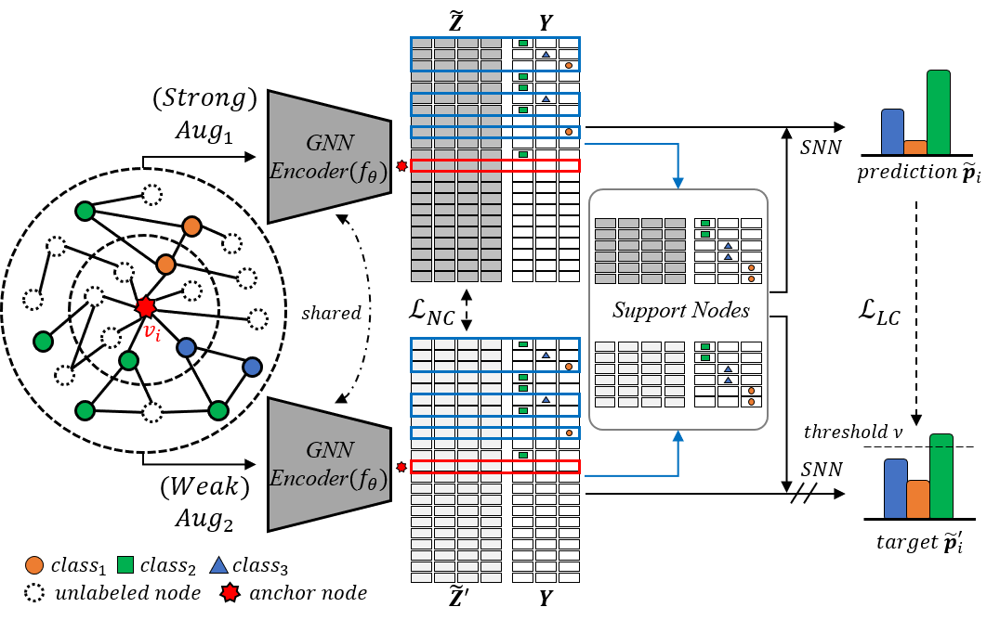

# GraFN: Semi-Supervised Node Classification on Graph with Few Labels via Non-Parametric Distribution Assignment

<p align="center">
  
  <a href="https://pytorch.org/" alt="PyTorch">
    </a>
  <a href="https://sigir.org/sigir2022/" alt="Conference">
    </a>


The official source code for "GraFN: Semi-Supervised Node Classification on Graph with Few Labels via Non-Parametric Distribution Assignment", accepted at SIGIR 2022(Short Paper).  

## Overview
Despite the success of Graph Neural Networks (GNNs) on various applications, GNNs encounter significant performance degradation when the amount of supervision signals, i.e., number of labeled
nodes, is limited, which is expected as GNNs are trained solely based on the supervision obtained from the labeled nodes. On the other hand, recent self-supervised learning paradigm aims to train
GNNs by solving pretext tasks that do not require any labeled nodes, and it has shown to even outperform GNNs trained with few labeled nodes. However, a major drawback of self-supervised
methods is that they fall short of learning class discriminative node representations since no labeled information is utilized during training.
To this end, we propose a novel semi-supervised method for graphs, GraFN, that leverages few labeled nodes to ensure nodes that belong to the same class to be grouped together, thereby achieving
the best of both worlds of semi-supervised and self-supervised methods. Specifically, GraFN randomly samples support nodes from labeled nodes and anchor nodes from the entire graph. Then, it
minimizes the difference between two predicted class distributions that are non-parametrically assigned by anchor-supports similarity from two differently augmented graphs. We experimentally show
that GraFN surpasses both the semi-supervised and self-supervised methods in terms of node classification on real-world graphs.

</img>

## Requirements
- Python version : 3.9.7
- Pytorch version : 1.10.1
- torch-geometric version : 2.0.3

## How to Run

- You can simply run our model with following codes.

```
git clone https://github.com/LJS-Student/GraFN.git
cd GraFN
sh run.sh
```
- Or you can reproduce our experiment result with reproduce.ipynb file.

### Hyperparameters

`--dataset:`
Name of the dataset. Supported names are: cora, citeseer, pubmed, computers, photo.  
usage example :`--dataset computers`

`--label_rate:`
Percentage of labeled nodes.  
usage example :`--label_rate 0.15`

`--tau:`
Temperature for Soft Nearest Neighbors(SNN) Strategy.  
usage example :`--tau 0.1`

`--thres:`
Theshold for determining whether a node has confident prediction.  
usage example :`--thres 0.8`

`--lam:`
Weight for Node-wise Consistency Regularization loss  
usage example :`--lam 0.5`

`--lam2:`
Weight for Label-guided Consistency Regularization loss  
usage example :`--lam2 0.5`

Using above hyper-parmeters, you can run our model with following codes  

```
python main.py --dataset computers --tau 0.1 --thres 0.8 --lam 0.5 --lam2 0.5
```

### Cite (Bibtex)
- If you find ``GraFN`` useful in your research, please cite the following paper:
  - Junseok Lee, Yunhak Oh, Yeonjun In, Namkyeong Lee, Dongmin Hyun, and Chanyoung Park. "GraFN: Semi-Supervised Node Classification on Graph with Few Labels via Non-parametric Distribution Assignment." SIGIR 2022(Short Paper).
  - If this work is helpful for your reserarch, you can kindly cite the following paper(will be updated when the SIGIR paper is published)
  - Bibtex
```
@article{lee2022grafn,
  title={GraFN: Semi-Supervised Node Classification on Graph with Few Labels via Non-Parametric Distribution Assignment},
  author={Lee, Junseok and Oh, Yunhak and In, Yeonjun and Lee, Namkyeong and Hyun, Dongmin and Park, Chanyoung},
  journal={arXiv preprint arXiv:2204.01303},
  year={2022}
}
```
